# Apex Plastics — D2C Target Architecture Assessment

**Programme:** Apex Direct (Direct-to-Consumer Digital Transformation)  
**Role lens:** Salesforce Solution Architect / Enterprise Architecture  
**Document type:** Architecture assessment & target-state design (pre-deck mock-up)  
**Author:** Kyle Cockcroft  
**Version:** 1.0 · August 2026 

---

## Document control

| Field | Value |
|---|---|
| **Primary audiences** | Executives (value, risk, ROI); Business stakeholders (process, change); Technical stakeholders (feasibility, integration) |
| **Architecture thesis** | *Shopify owns the cart; Salesforce owns the customer; MuleSoft owns the contracts; SAP stays off the synchronous D2C path until a cloud ERP replaces it.* |
| **Decision horizon** | Phase 1 launch **Q3 2026**; platformize through **Q2 2027**; ERP modernisation **Q3 2027–Q1 2028** |
| **Evaluation posture** | Short-term pragmatism *with* explicit technical debt; long-term vision protected by versioned API contracts and domain ownership |

### How to use this document

| Reader | Start here | Then |
|---|---|---|
| CEO / CFO | Section 1 Executive summary → Section 12 Risks → Section 13 Roadmap | Section 5 Commerce / Salesforce decisions (tables only) |
| Sales / Marketing / Ops leads | Section 3 Requirements traceability → Section 6–9 capability maps | Section 11 Operating model & change |
| CTO / IT / Architects | Section 4 Gaps → Section 5–10 full design → Section 14 ADRs → Section 15 Citations | Mermaid diagrams throughout; **Appendix C** for acronyms |

<strong>Table of contents</strong> — expand a group to jump to a section

> On GitHub you can also use the file **Outline** control (top-right of the rendered view) for a floating heading list.

Document control · Sections 1–5 (strategy &amp; platforms)

- [Document control](#document-control)
  - [How to use this document](#how-to-use-this-document)
- [1. Executive summary](#1-executive-summary)
  - [Recommended target shape (one page)](#recommended-target-shape-one-page)
  - [Verdict in four sentences](#verdict-in-four-sentences)
  - [Decisions requested from leadership](#decisions-requested-from-leadership)
- [2. Evaluation criteria &amp; architectural approach](#2-evaluation-criteria--architectural-approach)
  - [Pragmatism vs vision](#pragmatism-vs-vision--the-deliberate-balance)
- [3. Business requirements → architectural decisions](#3-business-requirements--architectural-decisions)
  - [3.1 Stakeholder requirement traceability](#31-stakeholder-requirement-traceability)
  - [3.2 Non-negotiable constraints](#32-non-negotiable-constraints)
- [4. Current-state assessment &amp; critical gaps](#4-current-state-assessment--critical-gaps)
  - [4.1 Current-state landscape](#41-current-state-landscape)
  - [4.2 Critical gaps](#42-critical-gaps-in-the-existing-architecture-materials)
  - [4.3 Gap severity heatmap](#43-gap-severity-heatmap-programme-risk)
- [5. E-commerce platform strategy](#5-e-commerce-platform-strategy)
  - [5.1 Intended use of the commerce platform](#51-intended-use-of-the-commerce-platform)
  - [5.2 Options evaluated](#52-options-evaluated)
  - [5.3 SFCC revisit gates](#53-salesforce-commerce-cloud--revisit-gates-phase-3)
  - [5.4 Launch catalog &amp; assortment](#54-launch-catalog--assortment-closes-g3)
  - [5.5 Content &amp; education hub](#55-content--education-hub-closes-g11)

Sections 6–10 (Salesforce · fulfilment · integration · MDM · security)

- [6. Salesforce platform strategy](#6-salesforce-platform-strategy)
  - [6.1 Role of Salesforce in Apex Direct](#61-role-of-salesforce-in-apex-direct)
  - [6.2 Edition &amp; clouds](#62-edition--clouds--decisions)
  - [6.3 Sales Cloud](#63-sales-cloud--functionality-map)
  - [6.4 Service Cloud](#64-service-cloud--returns--support-closes-g4)
  - [6.5 Experience Cloud](#65-experience-cloud--retailer-portal-closes-g6)
  - [6.6 Marketing Cloud](#66-marketing-cloud--intended-use)
  - [6.7 Analytics &amp; D2C P&amp;L](#67-analytics--d2c-pl-closes-g5)
- [7. Fulfilment, ERP &amp; adjacent systems](#7-fulfilment-erp--adjacent-systems)
  - [7.1 SAP R/3 interim strategy](#71-sap-r3-interim-strategy)
  - [7.2 D2C inventory truth](#72-d2c-inventory-truth)
  - [7.3 WMS vs 3PL](#73-wms-vs-3pl-decision-framework-closes-g12)
- [8. Integration architecture](#8-integration-architecture)
  - [8.1 Why hub-and-spoke](#81-why-hub-and-spoke-reject-more-p2p)
  - [8.2 Preferred hub — MuleSoft](#82-preferred-hub--mulesoft-anypoint)
  - [8.3 API-led layering](#83-api-led-layering)
  - [8.4 Happy-path D2C order](#84-happy-path-d2c-order-phase-2-steady-state)
  - [8.5 Integration matrix](#85-integration-matrix)
  - [8.6 Commercial / margin guards](#86-commercial--margin-guards-in-the-fabric-closes-g14)
- [9. Master data management](#9-master-data-management)
  - [9.1 Domain ownership](#91-domain-ownership-golden-record-map)
  - [9.2 Customer identity](#92-customer-identity-anti-duplicate-flow-closes-g9)
  - [9.3 MDM + PIM tooling](#93-mdm--pim-tooling)
  - [9.4 Channel conflict data model](#94-channel-conflict-data-model-closes-g1)
- [10. Security, compliance &amp; operability](#10-security-compliance--operability)
  - [10.1 PCI DSS](#101-pci-dss)
  - [10.2 POPIA &amp; consent](#102-popia--consent-closes-g2)
  - [10.3 Security &amp; edge](#103-security--edge)
  - [10.4 Service objectives](#104-service-objectives-closes-g10)

Sections 11–15 (operating model · risk · roadmap · ADRs · citations)

- [11. Operating model &amp; change](#11-operating-model--change)
  - [11.1 Delivery &amp; run model](#111-delivery--run-model)
  - [11.2 Organisational change](#112-organisational-change-closes-g7)
  - [11.3 Governance artefacts](#113-governance-artefacts)
- [12. Risks &amp; mitigations](#12-risks--mitigations)
- [13. Phased roadmap](#13-phased-roadmap)
  - [13.1 Timeline overview](#131-timeline-overview)
  - [13.2 Phase detail](#132-phase-detail)
  - [13.3 Budget roll-up](#133-budget-roll-up-technology-programme)
  - [13.4 Phase exit criteria](#134-phase-exit-criteria-closes-g8)
  - [13.5 First 30 days](#135-first-30-days-immediate-action-plan)
- [14. Architecture Decision Records](#14-architecture-decision-records)
- [15. Citations &amp; further reading](#15-citations--further-reading)

Appendices A–C (catalogue &amp; glossary)

- [16. Appendix A — Capability ↔ platform catalogue](#16-appendix-a--capability--platform-catalogue)
- [17. Appendix B — Glossary (short)](#17-appendix-b--glossary-short)
- [18. Appendix C — Glossary (long)](#18-appendix-c--glossary-long)
  - [C.1 Business &amp; commercial](#c1-business--commercial)
  - [C.2 Salesforce &amp; CRM](#c2-salesforce--crm)
  - [C.3 Commerce, payments, tax &amp; content](#c3-commerce-payments-tax--content)
  - [C.4 Integration &amp; middleware](#c4-integration--middleware)
  - [C.5 Data, identity &amp; master data](#c5-data-identity--master-data)
  - [C.6 ERP, warehouse &amp; operations](#c6-erp-warehouse--operations)
  - [C.7 Security, infrastructure &amp; operability](#c7-security-infrastructure--operability)
  - [C.8 Architecture method &amp; programme governance](#c8-architecture-method--programme-governance)
  - [C.9 Separation-of-concerns terms](#c9-separation-of-concerns-terms-used-as-labels-not-acronyms)

---

## 1. Executive summary

Apex Plastics is a R425M B2B manufacturer (380 accounts, ~8,500 SKUs) launching **Apex Direct** to serve homeowners, small contractors, farmers, and outdoor buyers who need smaller baskets and faster fulfilment than retail channels provide. Targets: **R60M Y1**, **R175M Y3 (~30% of revenue)**, launch **Q3 2026**.

The current estate cannot absorb that model as-is: **14-year SAP R/3** with no API layer, **homegrown Access WMS**, **Salesforce Professional** with weak adoption and no ERP link, **15 fragile point-to-point integrations**, a **7-person IT team**, and **zero PCI / D2C payment muscle memory**. Simultaneously, the top **12 retailers = 65% of revenue** — channel conflict is an existential business risk, not a UX preference.

### Recommended target shape (one page)

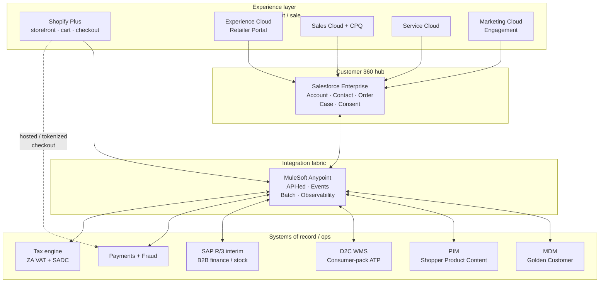

### Verdict in four sentences

1. **Commerce:** Adopt **Shopify Plus** for Phase 1 as *system of sale*; defer **Salesforce Commerce Cloud** until ERP is modern and TCO clears.  
2. **Salesforce:** Upgrade to **Enterprise Edition**; make Sales + Service + Marketing Cloud the **Customer 360** hub (identity, service, journeys, B2B conflict rules, lead escalation).  
3. **Integration & MDM:** Stop P2P growth; introduce **MuleSoft** (preferred) as hub; implement **MDM + PIM** in Phase 2 with domain ownership defined in Phase 1.  
4. **Roadmap:** Ship a **thin vertical slice** in Q3 2026 with *named* SAP nightly-batch debt; platformize in Phase 2; swap ERP behind stable APIs in Phase 3.

### Decisions requested from leadership

1. Approve target stack (Shopify Plus + Salesforce EE + Marketing Cloud + MuleSoft preferred + MDM/PIM in P2).  
2. Freeze Phase 1 scope: no ERP replacement, no SFCC, no full MDM on the launch critical path.  
3. Fund next-30-day delivery core: Integration Architect + DevOps path, Shopify/SF SI, QSA, two spikes (SAP interface inventory; iPaaS + identity match PoC).  
4. Mandate Apex-owned, versioned API contracts (Order, Inventory, Customer, Product) in Git before build.

---

## 2. Evaluation criteria & architectural approach

These criteria drove every include / exclude / defer decision in this assessment. They mirror the programme brief and global architecture practice (TOGAF ADM-style current→target→roadmap; Salesforce Well-Architected; API-led connectivity).

| Criterion | What “good” looks like for Apex | How it influenced decisions |
|---|---|---|
| **Stakeholder requirement fidelity** | CEO channel rules, CFO volume/tax/P&L, Sales conflict + lead routing, Marketing journeys/PIM, Ops unit-pick fulfilment, Finance auto-posting, IT staffing reality | Requirements → capability → platform mapping (Section 3) |
| **Time-to-value vs vision** | Live storefront by Q3 2026 *without* painting into a corner | Shopify P1; SFCC deferred; ERP P3; contracts owned early |
| **Separation of concerns** | System of Sale ≠ System of Engagement ≠ System of Record | Shopify / Salesforce / SAP+WMS+MDM split |
| **Integration sustainability** | No growth of the 15 P2P integrations | Hub-and-spoke via iPaaS; API-led layers |
| **Data integrity** | One golden customer; D2C ATP ≠ SAP pallet qty | MDM P2; WMS as D2C inventory SoR |
| **Risk & compliance** | PCI, POPIA, retailer backlash, SAP overload | Hosted checkout; consent model; conflict flags; batch isolation |
| **Operability** | 7 FTEs cannot run enterprise alone | Hybrid: hire key roles + SI + managed SOC/NOC |
| **TCO honesty** | Licence + SI + run + people + debt interest | Explicit phase budgets; Boomi as TCO alternative |
| **Exit / evolvability** | ERP and commerce can change without rewriting the estate | Versioned Experience/Process/System APIs |

### Pragmatism vs vision — the deliberate balance

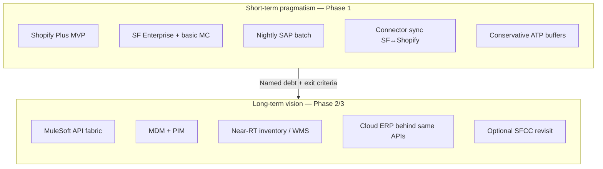

**Rule used throughout:** Accept debt only when (a) it unblocks Q3 2026, (b) it is *named* with an owner and retirement phase, and (c) it does not create irreversible lock-in (business logic stays in Salesforce/MuleSoft contracts, not Shopify scripts or one-off SAP RFCs).

---

## 3. Business requirements → architectural decisions

### 3.1 Stakeholder requirement traceability

| Stakeholder need | Architectural response | Phase |
|---|---|---|
| Protect top-12 retailers (65% revenue); D2C for small/custom/rush only | Channel-conflict rules in Salesforce; SKU/geo/basket guards; Marketing suppression for B2B-managed accounts | P1 rules (manual+config) → P2 automated |
| Profitable ~R350 orders (vs R15k B2B MOQ) | Dedicated D2C WMS / each-pick; consumer packaging; shipping rate cards; optional order-floor rules | P1 packaging MVP → P2 WMS |
| 75k–125k orders/mo must not collapse SAP | Keep SAP off synchronous D2C path; batch P1 → near-RT P2 → cloud ERP P3 | P1–P3 |
| Single customer view + R25k/6-mo lead routing | Salesforce as engagement hub; Order + lifecycle events; Flow/apex routing | P1 basic → P2 hardened |
| CPQ for custom moulding + transactional D2C | Sales Cloud + CPQ for complex; Shopify for catalog commerce; no forced unification in P1 | P1+ |
| Triggered journeys, attribution, CAC/LTV | Marketing Cloud + commerce/CRM events; analytics mart; Data Cloud evaluate later | P1 basic → P2 advanced |
| 8,500 SKUs need shopper content | PIM as content SoR; ERP retains SKU/cost/BOM | P2 (P1 curated MVP catalog) |
| Card pay-before-ship, PCI, fraud, ZA+SADC tax | Hosted/tokenized checkout; fraud scoring; tax engine | P1 |
| Separate D2C P&L for board | Chart of accounts / product hierarchy tags; finance extract; BI dimensions | P1 finance tags → P2 BI |
| Sales compensation clarity | *Business* policy first; tech enforces attribution flags (D2C vs retail-assisted) | P1 policy → P2 reporting |
| Retailer portal with availability | Experience Cloud site on Salesforce; inventory via MuleSoft from WMS | P2 (P1 read-only backlog OK) |
| POPIA consent for SA digital marketing | Consent objects in Salesforce; journey entry gated; Shopify consent sync | P1 |

### 3.2 Non-negotiable constraints

| Constraint | Implication |
|---|---|
| Q3 2026 launch | Commerce platform must be mid-market speed-to-live (Shopify-class), not a 12–18 month suite programme |
| SAP R/3 2011, Oracle 11g, no API layer | Treat ERP as *batch-capable SoR*, not real-time commerce backend |
| 7-person IT, maintenance-mode skills | Hybrid delivery; do not staff every specialty permanently |
| Channel conflict existential | Architecture must encode retailer protection, not only marketing copy |
| PCI is new | Prefer SAQ A / A-EP patterns; engage QSA in Phase 1 |

---

## 4. Current-state assessment & critical gaps

### 4.1 Current-state landscape

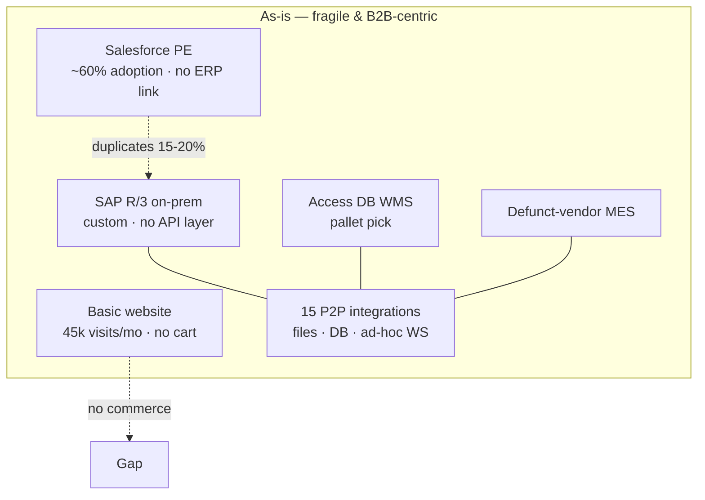

| Domain | Current state | Fitness for D2C |
|---|---|---|
| Commerce | Brochure site only | **Unfit** |
| CRM | SF Professional, weak adoption, duplicates | **Partially fit** — upgrade + process redesign required |
| Marketing | Trade/B2B mature; digitally immature; no automation | **Unfit** for D2C CAC/LTV model |
| ERP / Finance | SAP R/3; 3,200 invoices/mo manual-heavy | **Unfit** for 75k–125k D2C orders synchronously |
| Fulfilment | Pallet WMS; bulk packs | **Unfit** for each-pick unit economics |
| Integration | 15 heterogeneous P2P links | **Unfit** — will compound with +8–10 D2C links |
| Infrastructure | Single-ISP DC; no CDN/WAF posture | **Unfit** for public internet retail |
| Security / PCI | No card-acceptance programme | **Unfit** |
| People / ops model | 7 IT FTEs, maintenance mode | **Unfit** without hybrid augmentation |
| Data | No golden customer; ERP product data not shopper-ready | **Unfit** |

### 4.2 Critical gaps in the *existing* architecture materials

The discovery brief and technical compendium establish a sound direction. The gaps below are what this assessment closes before decks are built.

| # | Gap | Why it matters | Closed in this doc by |
|---|---|---|---|
| G1 | **Channel-conflict model underspecified** | Retailer backlash can erase D2C ROI | Section 9.4 channel conflict data model (+ Section 8.3 Process API guard) |
| G2 | **POPIA / consent architecture missing** | Illegal or untrusted marketing kills MC value | Section 10.2 POPIA and consent |
| G3 | **MVP catalog / assortment strategy absent** | 8,500 SKUs cannot all be D2C-ready by Q3 | Section 5.4 launch catalog and assortment |
| G4 | **Returns / RMA process thin** | 3–5% returns vs &lt;0.5% B2B | Section 6.4 Service Cloud returns and support |
| G5 | **Analytics / attribution stack vague** | Board CAC/LTV/P&amp;L needs cannot be met by CRM alone | Section 6.7 analytics and D2C P&amp;L |
| G6 | **Retailer portal deferred without interim story** | Sales explicitly required availability visibility | Section 6.5 Experience Cloud retailer portal |
| G7 | **Compensation / attribution** treated as “policy only” | Sales sabotage risk is real | Section 11.2 organisational change (+ Section 9.4 attribution flags) |
| G8 | **Phase exit criteria / debt retirement gates weak** | Named debt without gates becomes permanent | Section 13.4 phase exit criteria |
| G9 | **Identity model** (guest vs registered vs B2B contact) incomplete | Duplicates and wrong marketing suppression | Section 9.2 customer identity anti-duplicate flow |
| G10 | **Observability / RTO-RPO / support hours** glossary-only | D2C is 24/7 customer-facing | Section 10.4 service objectives (SLOs) |
| G11 | **Content/CMS & education hub** (marketing vision) not placed | Community/content is part of brand control thesis | Section 5.5 content and education hub |
| G12 | **3PL vs owned WMS decision framework** incomplete | R7.5M warehouse automation vs outsource | Section 7.3 WMS vs 3PL decision framework |
| G13 | **SFCC revisit criteria** qualitative only | Avoid endless “maybe Commerce Cloud” debates | Section 5.3 SFCC revisit gates |
| G14 | **Order profitability / floor-price guards** missing | R350 AOV can destroy margin with shipping | Section 8.6 commercial and margin guards |

### 4.3 Gap severity heatmap (programme risk)

Most gaps (G1–G4, G7–G9, G12, G14) sit in the **same quadrant** — high urgency and high severity before Q3 2026. The view below uses a **priority matrix** (grouped lists). Quadrant placement reflects the **architect's estimate** of each gap's urgency, severity, and relative priority. A **cross-functional workshop** should be held to validate and reassess the importance of the gaps outlined in this document before they are used for programme governance or scope decisions. Point labels G1–G14 map to the gap table in Section 4.2.

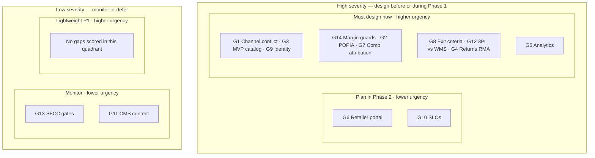

---

## 5. E-commerce platform strategy

### 5.1 Intended use of the commerce platform

| Concern | Owner platform | Why |
|---|---|---|
| Browse, search, merchandising, cart, checkout | **Shopify Plus** | System of *sale* — speed, PCI reduction, D2C patterns |
| Customer identity, service, B2B relationships, journeys | **Salesforce** | System of *engagement* |
| Inventory truth for D2C ATP | **D2C WMS** (via MuleSoft) | Consumer-pack quantities, not SAP pallets |
| Financial posting / B2B order-to-cash | **SAP → Cloud ERP** | System of *record* for finance |
| Shopper-facing product content | **PIM** | ERP is manufacturing-centric |

**Shopify is not the customer master.** It holds storefront session/customer records that sync to Salesforce/MDM. Business rules that protect retailers, escalate leads, and suppress journeys live in Salesforce (+ MuleSoft process APIs).

### 5.2 Options evaluated

#### Option A — Shopify Plus *(recommended Phase 1)*

| | |
|---|---|
| **What it is** | Enterprise SaaS commerce for high-volume D2C brands |
| **Performs in this architecture** | Storefront, cart/checkout, catalog, promos, basic OMS, app ecosystem, CDN hosting, payment integrations |
| **Why chosen** | Credible Q3 2026 path (typical MVP **3–6 months**); hosted/tokenized checkout shrinks PCI scope; strong mid-market D2C ecosystem in/near SA via partners; exit path preserved if logic stays in MuleSoft/SF |

| Pros | Cons |
|---|---|
| Fastest time-to-live aligned to Q3 2026 | Not native Salesforce — dual-stack complexity |
| PCI scope reduction (SAQ A / A-EP patterns) | GMV-linked cost must be modelled for Y3 (R175M) |
| Huge app/partner ecosystem for tax, fraud, subscriptions | Complex B2B price books / CPQ remain outside Shopify |
| Easier to staff/SI in mid-market ZA context | Risk of “logic in Liquid/apps” lock-in if governance is weak |

#### Option B — Salesforce Commerce Cloud (B2C) *(deferred)*

| | |
|---|---|
| **What it is** | Salesforce enterprise commerce suite |
| **Would perform** | Storefront + deeper native CRM commerce objects when fully adopted |
| **Why not Phase 1** | Does **not** fix SAP R/3; typical complex enterprise builds run **longer** than Shopify MVP; Apex critical path is *launch + integration + ops*, not commerce-suite consolidation |

| Pros | Cons |
|---|---|
| Native Customer 360 narrative | Longer / heavier implementation for this context |
| One vendor commercial relationship | Still needs iPaaS, WMS, tax, payments, PIM |
| Stronger long-term SF process unification | Higher TCO before GMV proves out |

#### Option C — Adobe Commerce (Magento) *(rejected for P1)*

| Pros | Cons |
|---|---|
| Very flexible / robust catalog capabilities | **8–12 month** class programmes common; heavier ops |
| Strong B2B+B2C in one platform (theoretically) | Overlaps badly with “keep B2B motion in Salesforce CPQ” |
| | Larger security/patching surface than SaaS Shopify |

**Decision (ADR-01):** Shopify Plus for Phase 1 system of sale; Adobe out; SFCC on a gated revisit (see Section 5.3).

### 5.3 Salesforce Commerce Cloud — revisit gates (Phase 3+)

Revisit SFCC **only if all** are true:

1. Cloud ERP live (or irrevocably contracted) and Order/Inventory APIs stable.  
2. D2C GMV and contribution margin sustain SFCC TCO (licence + SI + rebuild).  
3. Unified Salesforce commercial processes (promotions, shared catalog services, service-commerce) demonstrably outweigh migration cost.  
4. Shopify Plus contractual / GMV economics deteriorate relative to SFCC.  
5. Business accepts a **replatform freeze** window (typically a full planning year).

Until then, invest in **MuleSoft contracts + Salesforce Customer 360**, not a second storefront programme.

### 5.4 Launch catalog & assortment (closes G3)

Do **not** attempt 8,500 shopper-ready SKUs at launch.

| Wave | Scope | Intent |
|---|---|---|
| **MVP catalog (P1)** | ~150–300 high-velocity consumer SKUs (tanks, storage, outdoor, waste) with complete imagery/specs | Prove unit economics & ops |
| **Wave 2** | Expand by category; exclude custom moulding from self-serve | Protect CPQ motion |
| **Wave 3** | Long-tail via PIM-driven publish | Scale content factory |

**Channel-safe assortment rule:** Prefer SKUs / pack sizes retailers under-serve (each-packs, rush, accessories, education-led kits). Flag “retail-sensitive” SKUs for geo or login gating if Sales Leadership requires.

### 5.5 Content & education hub (closes G11)

Marketing’s vision (install videos, selectors, forums, webinars) is brand-control infrastructure — but it is **not** on the P1 critical path for checkout.

| Capability | P1 | P2+ |
|---|---|---|
| Product story content | Shopify theme + curated CMS sections | PIM-driven rich content |
| Education / SEO hub | Lightweight blog or headless CMS linked from store | Dedicated content site / Experience Cloud microsite |
| Community / forums | Out of scope | Evaluate later (moderation cost is high) |
| Webinars | Manual (Zoom + MC journeys) | Automated nurture in MC |

---

## 6. Salesforce platform strategy

### 6.1 Role of Salesforce in Apex Direct

**Intended use:** Salesforce is the **Customer 360 system of engagement** — the place where B2B relationships, D2C customers, service history, marketing consent, and commercial conflict rules coexist.

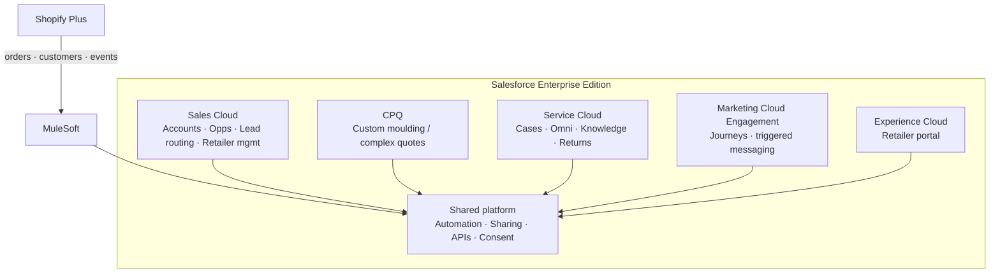

### 6.2 Edition & clouds — decisions

| Component | Decision | Reason | Pros | Cons |
|---|---|---|---|---|
| **Edition** | Upgrade **Professional → Enterprise** | PE lacks API volume, automation depth, and sharing sophistication for D2C + iPaaS | Unlocks Customer 360 thesis | Licence uplift |
| **Sales Cloud** | Core B2B + D2C lead escalation | Already in estate; relationship sellers stay here | Continuity; conflict ownership | Adoption work required |
| **CPQ** | Retain/expand for custom moulding | Different sales motion from cart checkout | Protects high-margin custom | Two quote paradigms to govern |
| **Service Cloud** | Mandatory for D2C | Returns 3–5%; product advice at scale; same customer record | True 360 with Sales | New queues, SLAs, staffing |
| **Marketing Cloud Engagement** | Selected for volume journeys | D2C needs behavioural triggers at scale; SF-aligned | Native-ish SF journey story | Cost; needs data discipline |
| **Account Engagement (Pardot)** | Budget fallback only | Stronger for B2B MQLs than high-volume cart triggers | Cheaper entry | Weak fit for abandon-cart scale |
| **Commerce Cloud** | Deferred | See Section 5 | — | — |
| **Data Cloud** | Evaluate Phase 2/3 | CDP value appears after event volume exists | Unified profile/activation | Premature TCO in P1 |
| **Experience Cloud** | Retailer portal in Phase 2 | Sales requirement; inventory from WMS | Authenticated B2B UX on SF | Build + licence |

### 6.3 Sales Cloud — functionality map

| Function | How it works |
|---|---|
| Account / Contact master *of engagement* | Upserted from Shopify + SAP via match rules; golden ID from MDM in P2 |
| Retailer hierarchy | Top-12 strategic accounts tagged; partner price plans remain B2B-only |
| Lead routing | When D2C customer spend ≥ **R25k in 6 months** → create/route Lead/Opp to regional sales |
| Opportunity / tender | Unchanged for municipal/government motion |
| Conflict case | “Channel conflict” record type when retailer complains or rule breach detected |
| Commission inputs | D2C vs assisted flags on Order for Finance/Sales ops (policy still human) |

### 6.4 Service Cloud — returns & support (closes G4)

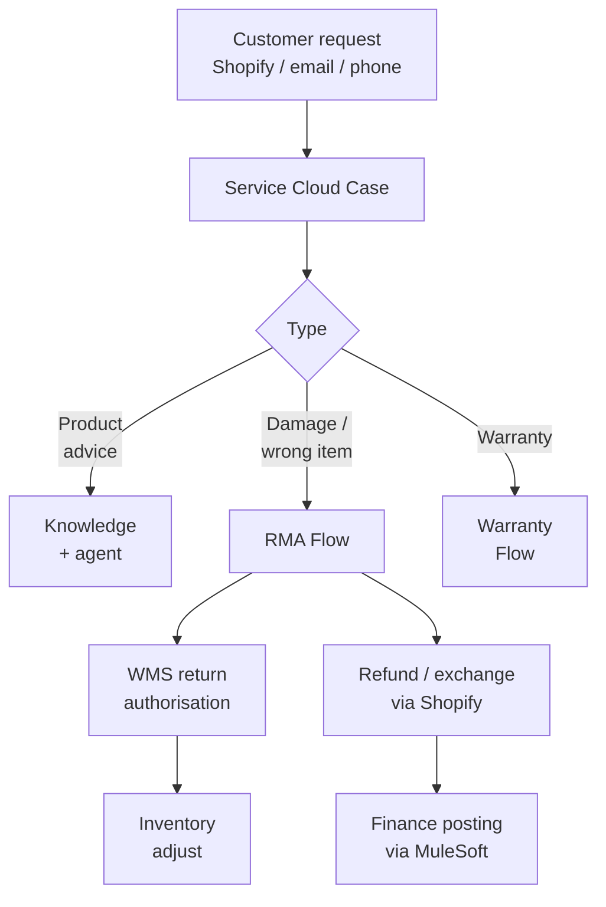

**P1 minimum:** Case management, email-to-case, knowledge for top SKUs, manual RMA checklist.  
**P2:** Omni-channel chat, automated RMA, return reasons analytics feeding PIM content gaps.

### 6.5 Experience Cloud — retailer portal (closes G6)

| Phase | Capability |
|---|---|
| P1 | Sales-assisted PDF/availability reports from buffered ATP (interim) |
| P2 | Authenticated retailer portal: catalog visibility, ATP, order status, co-op assets |
| P3 | Forecast sharing / collaborative planning if retailers engage |

Do **not** build a second B2B commerce checkout in P1 — it competes with D2C delivery focus and Salesforce CPQ.

### 6.6 Marketing Cloud — intended use

| Journey / capability | Phase | Notes |
|---|---|---|
| Welcome / post-purchase | P1 | Low risk |
| Abandoned cart | P1 | Requires Shopify events + consent |
| Educational nurture (tank sizing, etc.) | P1–P2 | Supports brand-control thesis |
| Win-back / replenishment | P2 | Needs purchase cadence data |
| Retailer-protected suppression | P1 flag → P2 automated | **Hard requirement** |
| Paid media audiences | P2 | Export consented segments |

**Account Engagement** remains a fallback only if MC commercials break the marketing budget — accept weaker cart-trigger capability if so.

### 6.7 Analytics & D2C P&L (closes G5)

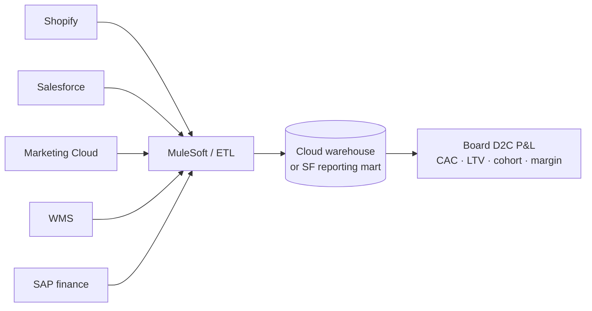

P1: tagged finance extracts + Shopify/SF native reports.  
P2: proper warehouse + attribution.  
Data Cloud: only after event quality is proven.

---

## 7. Fulfilment, ERP & adjacent systems

### 7.1 SAP R/3 interim strategy

| | |
|---|---|
| **Intended use (interim)** | B2B SoR; D2C **financial** posting destination; not storefront ATP |
| **Why retained** | Replacement R12–18M / 18+ months misses Q3 2026 |
| **P1 pattern** | Nightly batch orders/settlements; manual exception queue; conservative reconciliation |
| **P2 pattern** | Near-real-time posting via MuleSoft System API where SAP customisations allow |
| **P3 pattern** | Cloud ERP (S/4HANA Cloud, D365, or NetSuite) behind the **same** OrderSettled contract |

| Pros of interim batch | Cons |
|---|---|
| Protects SAP from volume shock | Finance reconciliation debt |
| Buys time for ERP selection | Overnight lag on financial truth |
| Forces API thinking early | Temptation to “just add another RFC” — must be governed |

### 7.2 D2C inventory truth

**Hard rule:** Storefront ATP = **consumer-pack WMS** (minus safety buffer), never raw SAP pallet quantities.

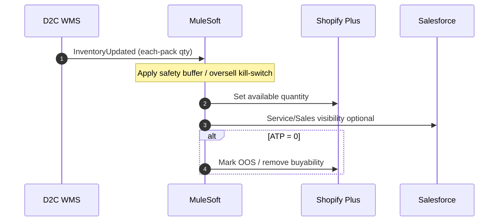

### 7.3 WMS vs 3PL decision framework (closes G12)

| Option | When preferable | Pros | Cons |
|---|---|---|---|
| **Owned D2C FC + WMS** | Volume trajectory clear; want process control | Control, data richness | Capex, staffing (60–150 FTE cited), longer stand-up |
| **3PL with WMS integration** | Speed to P1/P2; uncertain volume | Faster, opex-heavy, shifts labour risk | Less control; integration still required; margin leakage |
| **Hybrid** | Plant keeps bulk; 3PL does each-pick | Pragmatic | Two inventory pools to aggregate |

**Recommendation:** Run a **30-day commercial spike** in Phase 1 planning — if 3PL can meet 2-day metro SLAs and integrate via MuleSoft events, prefer **3PL for Year 1** to protect Q3; revisit owned automation when order density justifies R7.5M.

---

## 8. Integration architecture

### 8.1 Why hub-and-spoke (reject more P2P)

Apex already has **15** custom P2P integrations. D2C adds ~**8–10** more connections. Point-to-point yields N×N growth, duplicated logic, and ERP cutover rewrites.

| Point-to-point (reject) | Hub-and-spoke via iPaaS (adopt) |
|---|---|
| N×N connection growth | Spokes talk only to hub |
| Logic duplicated per pair | Reusable System / Process / Experience APIs |
| No central DLQ/monitoring | One observability plane |
| ERP cutover rewrites every link | Swap adapters; keep contracts |

### 8.2 Preferred hub — MuleSoft Anypoint

| | |
|---|---|
| **What it is** | Salesforce iPaaS / API management platform |
| **Performs** | API-led integration, orchestration, SAP/SF connectors, monitoring, governance |
| **Why preferred** | Strategic fit with Salesforce; proven hybrid SAP+SaaS pattern; enables Phase 3 ERP swap |

| Pros | Cons |
|---|---|
| API-led discipline matches target architecture | Licence + skills cost |
| Strong Salesforce / SAP connector story | Overkill if poorly scoped (avoid “boiling the ocean” in P1) |
| Governance & reuse for 10+ year estate | Requires Integration Architect ownership |

**Alternative — Boomi:** Acceptable if a 2–3 week spike shows better TCO/skills availability in ZA. Decide with evidence, not brand preference (ADR-04).

### 8.3 API-led layering

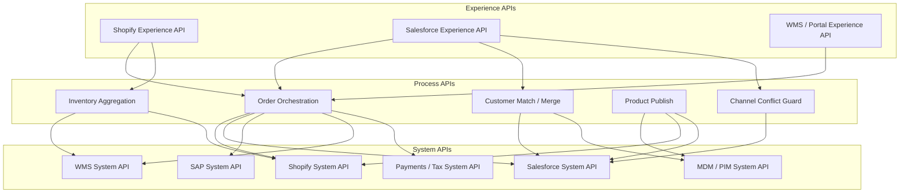

| Layer | Responsibility | Example |
|---|---|---|
| **System API** | Unlock one SoR safely | `GET /sap/customers/{id}` |
| **Process API** | Encode cross-system business process | `POST /orders/orchestrate` |
| **Experience API** | Shape payload for one channel | Shopify webhook → canonical order |

### 8.4 Happy-path D2C order (Phase 2 steady-state)

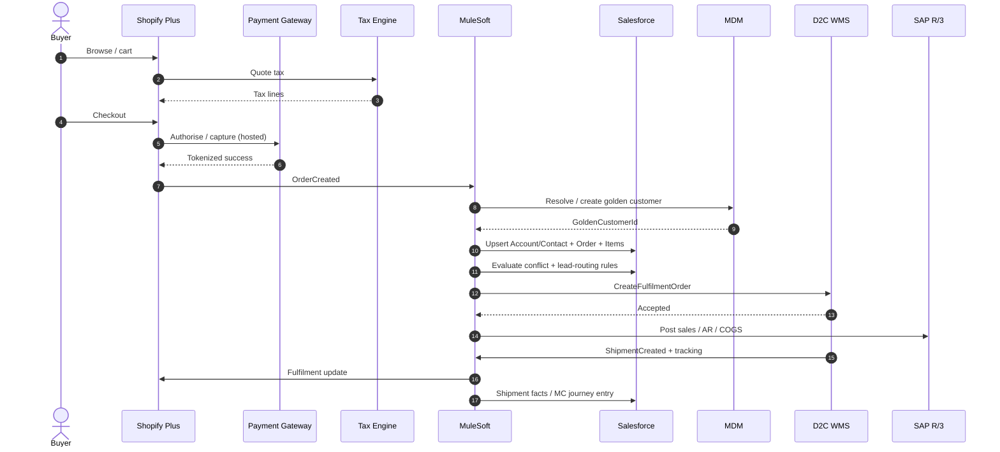

**Phase 1 explicit debt:** Shopify↔Salesforce via connector/native sync; **nightly** SAP finance batch; ATP buffers until WMS events exist; conflict rules largely configuration + manual Sales ops.

### 8.5 Integration matrix

| From → To | Via | Pattern | Phase |
|---|---|---|---|
| Shopify → Salesforce | Connector P1; MuleSoft P2 | Event / upsert | P1→P2 |
| Shopify → SAP | MuleSoft only | Batch → near-RT | P1+ |
| Shopify → WMS | MuleSoft | Command + events | P2 |
| Salesforce ↔ MDM | MuleSoft | Match/merge | P2 |
| PIM → Shopify/SF | MuleSoft | Publish | P2 |
| Payments → Shopify | Native hosted | Tokenized | P1 |
| Tax → Shopify/Mule | Tax API | Quote + commit | P1 |
| MC ← events | SF + MuleSoft | Journey entry | P1/P2 |

**Hard rule after Phase 2 cutover:** No new direct Shopify↔SAP, Shopify↔WMS, or Salesforce↔SAP links outside the hub.

### 8.6 Commercial / margin guards in the fabric (closes G14)

Process API checks (configurable):

- Minimum order value / shipping subsidy caps  
- Restricted postcodes (fulfilment SLA)  
- Retail-sensitive SKU gating  
- Fraud score thresholds before capture  

These belong in **Process APIs + Salesforce**, not only in Shopify Scripts — so they survive a commerce replatform.

---

## 9. Master data management

### 9.1 Domain ownership (golden-record map)

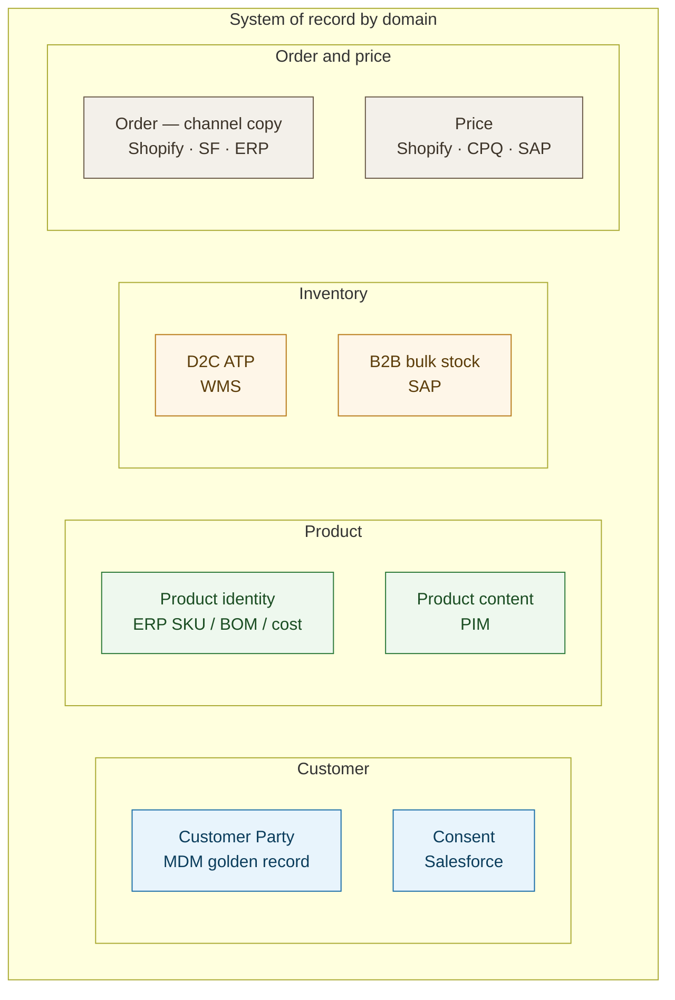

| Domain | System of Record | Consumers | Notes |
|---|---|---|---|
| **Party / Customer** | MDM (P2); Salesforce engagement master in P1 | SF, Shopify, SAP, MC | Match on email/mobile/VAT/company keys |
| **B2B Account hierarchy** | Salesforce | Portal, Sales | Retailer protection flags live here |
| **Product identity** | ERP | PIM, SF Product2, Shopify | Immutable SKU/BOM/cost |
| **Product content** | PIM | Shopify, web, portal | Imagery, guides, SEO copy |
| **D2C ATP** | WMS | Shopify, SF, portal | Buffered |
| **B2B stock** | SAP | Sales, planning | Not for storefront |
| **D2C price** | Shopify price lists (+ SF reference) | Storefront | Margin floors governed centrally |
| **B2B price / quote** | SAP + CPQ | Sales | Never overwrite from Shopify |
| **Consent / preferences** | Salesforce | MC, Shopify | POPIA basis |
| **Order** | *Orchestrated* — Shopify sale, SF engagement, ERP finance | All | Canonical Order ID from MuleSoft |

### 9.2 Customer identity anti-duplicate flow (closes G9)

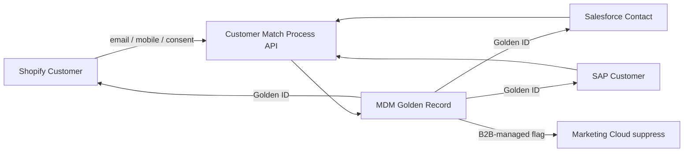

**Survivorship (initial):** verified email > mobile > most-recently-enriched address; **B2B-managed** and **retailer-protected** flags never auto-cleared by D2C activity without Sales workflow.

### 9.3 MDM + PIM tooling

| Layer | Phase 1 | Phase 2 |
|---|---|---|
| Customer match | Salesforce duplicate rules + MuleSoft PoC | MDM (Informatica / Reltio / Semarchy-class) |
| Product content | Manual curation in Shopify for MVP SKUs | PIM (Akeneo / Salsify-class) |
| Governance | Data stewards named (Sales Ops + Marketing) | Stewardship workflows + DQ scorecards |

**Why not full MDM in Phase 1:** Tooling + stewardship rarely fit a commerce MVP critical path; but **match keys, golden ID field, and survivorship policy must be designed in Phase 1** so P2 does not rework identity.

### 9.4 Channel conflict data model (closes G1)

Minimum Salesforce fields / flags:

| Flag / object | Purpose |
|---|---|
| `B2B_Managed__c` | Account under active retailer/sales ownership — suppress promo journeys |
| `Retailer_Protected_Geo__c` / SKU lists | Optional gating |
| `Channel_Conflict_Case__c` | Process retailer complaints |
| `D2C_Spend_Rolling_6m__c` | Lead routing threshold |
| `Assisted_by_Sales__c` on Order | Compensation attribution input |

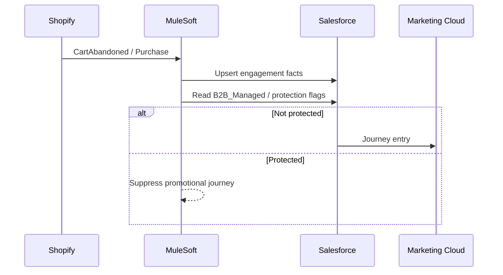

---

## 10. Security, compliance & operability

### 10.1 PCI DSS

| Pattern | Choice |
|---|---|
| Card data | **Never** store PAN in Apex systems |
| Checkout | Hosted / tokenized (Shopify + gateway) |
| Target SAQ | A or A-EP per QSA advice |
| Programme | QSA engaged in Phase 1; annual rhythm |

### 10.2 POPIA & consent (closes G2)

South African D2C marketing without lawful basis is a programme-killer.

| Control | Implementation |
|---|---|
| Capture | Checkout + preference centre; purpose-specific consents |
| Store | Salesforce Consent model (or Custom Consent objects) as SoR |
| Sync | Shopify marketing flags ↔ Salesforce via MuleSoft |
| Enforce | MC journeys require active consent + not B2B-managed |
| Rights | Access/erasure process spanning Shopify, SF, MC, MDM |

### 10.3 Security & edge

| Control | Phase |
|---|---|
| Cloud edge (AWS/Azure), WAF, DDoS posture | P1 |
| Hybrid connectivity to on-prem SAP (VPN/private link) | P1 |
| Fraud scoring at payment | P1 |
| SIEM + managed detection | P1 (managed service) |
| Pen test before launch | P1 gate |
| Bot protection on storefront | P1 |

### 10.4 Service objectives (closes G10)

| Service | Target (initial) | Notes |
|---|---|---|
| Storefront availability | 99.9% monthly | Shopify + edge |
| Checkout success | Monitor conversion funnel | Alert on payment error spikes |
| Order → WMS accept | &lt; 5 min P2; best-effort P1 | |
| Inventory publish | &lt; 5 min P2 | Buffers in P1 |
| RPO (order events) | ≤ 15 min | Durable queue / replay |
| RTO (integration hub) | ≤ 4 hours | Runbook + managed ops |
| Support hours | Storefront 24/7 platform; human support business+extended | Staffing model Section 11 |

---

## 11. Operating model & change

### 11.1 Delivery & run model

| Role | Model |
|---|---|
| Integration Architect | **Hire** (owns contracts, ADR governance) |
| DevOps / cloud | **Hire or dedicated contractor** |
| Shopify + Salesforce build | **SI** |
| MuleSoft build | **SI** under Architect direction |
| 24/7 monitoring / SOC | **Managed service** |
| QSA / PCI | **Specialist** |
| Internal IT (7) | Keep SAP/B2B lights-on; do not divert entirely to D2C |

### 11.2 Organisational change (closes G7)

Technology cannot fix ambiguous commission policy.

| Workstream | Owner | Output before launch |
|---|---|---|
| Retailer communication pack | Retail Relations | Positioning: small/custom/rush; not Builders-shelf clone |
| Sales compensation policy | VP Sales + CFO | Written rules for cannibalisation & assisted deals |
| D2C team design | CEO / COO | Separate digital P&L team vs. “everyone owns D2C” |
| Data stewardship | Sales Ops + Marketing | Golden record dispute process |
| Returns policy | Service + Finance | Customer-clear RMA terms |

### 11.3 Governance artefacts

- Architecture Decision Records (see Section 14)  
- Versioned OpenAPI contracts in Apex Git  
- Integration backlog with DLQ ownership  
- Monthly architecture review (CTO + Integration Architect + SI leads)

---

## 12. Risks & mitigations

| ID | Risk | Impact | Likelihood | Mitigation |
|---|---|---|---|---|
| R1 | Retailer backlash / channel conflict | Existential revenue | M | Conflict flags, assortment rules, exec sponsor messaging, portal transparency P2 |
| R2 | SAP performance / opaque customisations | Finance break; launch slip | H | Week 1–3 interface inventory; nightly batch; volume isolation; kill-switch |
| R3 | Inventory oversell | CX damage; margin hit | H | WMS as ATP SoR; safety buffers; OOS automation; P2 near-RT mandatory |
| R4 | Unit economics negative at ~R333 AOV | Strategy failure | M | 3PL spike; shipping caps; MVP SKU margin model; packaging programme |
| R5 | PCI / security incident | Legal + brand | M | Hosted checkout; QSA; WAF; fraud; pen test gate |
| R6 | POPIA non-compliance | Fines + MC shutdown | M | Consent SoR; journey gates; DPIA |
| R7 | Integration sprawl resumes | Unmaintainable estate | M | Hub mandate; no P2P exceptions without ADR |
| R8 | Shopify logic lock-in | Costly replatform | M | No critical business rules only in Liquid; contracts in MuleSoft/SF |
| R9 | Skills / 7-FTE overload | Outages; burnout | H | Hybrid hire + SI + managed ops; protect B2B support capacity |
| R10 | Timeline pressure → skipped debt gates | Permanent temporary | H | Exit criteria Section 13.4; CTO RAG on debt items |
| R11 | Sales sabotage via ambiguous commission | Adoption failure | M | Policy before go-live; attribution flags |
| R12 | MDM delayed forever | Duplicate chaos | M | P1 identity design mandatory; P2 funding ring-fenced |
| R13 | Tax/SADC edge cases | Compliance / margin | M | Tax engine P1; finance exception queue |
| R14 | Returns surge | Cost + CX | M | Knowledge base; clear specs; RMA Flow; reason codes → PIM |

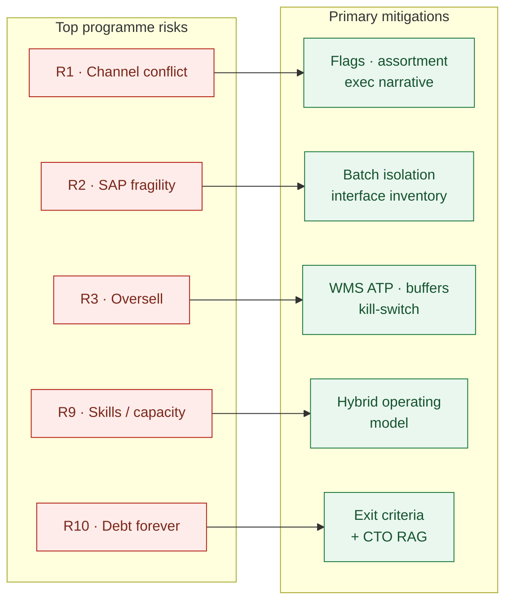

---

## 13. Phased roadmap

### 13.1 Timeline overview

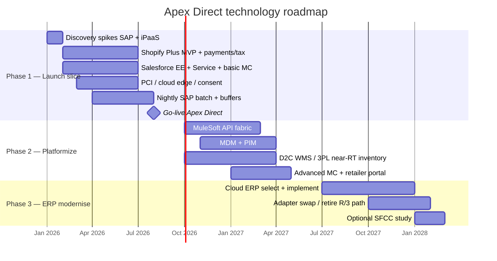

### 13.2 Phase detail

#### Phase 1 — Thin vertical slice (Q1–Q3 2026) · Budget R6–8M

**Outcome:** Paying customers on Apex Direct; Salesforce has customer+order engagement; finance gets nightly postings; PCI programme live; retailers briefed; conflict flags operational.

| Workstream  | In scope                                                       | Explicitly out                        |
| ----------- | -------------------------------------------------------------- | ------------------------------------- |
| Commerce    | Shopify Plus MVP catalog, checkout, payments, tax              | SFCC; 8,500 SKU perfection            |
| Salesforce  | EE upgrade, Sales+Service foundation, lead routing v1, consent | Full Omni, Data Cloud                 |
| Marketing   | MC welcome / abandon / post-purchase                           | Advanced personalisation engine       |
| Integration | Connector SF↔Shopify; nightly SAP batch; tax/pay native        | Full MuleSoft fabric                  |
| Data        | Duplicate rules; golden ID fields reserved                     | Full MDM/PIM                          |
| Ops         | Packaging for MVP SKUs; fulfilment interim (3PL or pilot FC)   | Full warehouse automation             |
| Security    | QSA, WAF, fraud, pen test                                      | Mature SIEM use-cases beyond baseline |

#### Phase 2 — Platformize (Q4 2026–Q2 2027) · Budget R4–5.5M

**Outcome:** Hub-and-spoke live; near-RT inventory; MDM/PIM; advanced journeys; retailer portal; debt from P1 retired on schedule.

#### Phase 3 — Cloud ERP (Q3 2027–Q1 2028) · Budget R12.5–17.5M

**Outcome:** Modern ERP; SAP R/3 path retired; same Order/Inventory/Customer contracts; optional SFCC business case using Section 5.3 gates.

### 13.3 Budget roll-up (technology programme)

| Phase | Tech budget | Primary spend |
|---|---|---|
| P1 | R6–8M | Commerce SI, SF licences/SI, payments/tax, PCI/cloud, interim integration |
| P2 | R4–5.5M | MuleSoft, MDM/PIM, WMS/3PL integration, portal, advanced MC |
| P3 | R12.5–17.5M | Cloud ERP + migration |
| **Note** | *Excludes* full R7.5M warehouse automation & R3M Y1 marketing media if tracked separately by CFO | Keep P&L views distinct |

### 13.4 Phase exit criteria (closes G8)

| Phase | Must be true to exit |
|---|---|
| **P1 → P2** | Storefront live; payment/tax stable; nightly SAP reconciliation &lt; agreed error rate; consent enforced; conflict flags used by Sales; pen test findings closed or risk-accepted; Integration Architect hired; OpenAPI stubs for Order/Inventory/Customer/Product in Git |
| **P2 → P3** | MuleSoft hub mandatory path for new integrations; WMS/3PL ATP driving storefront; MDM golden IDs on ≥95% active D2C customers; PIM publishing MVP+wave2; retailer portal ATP live; P1 connector debt retired |
| **P3 done** | Cloud ERP posting D2C+B2B; R/3 decommission plan executed; SFCC decision recorded (proceed or explicitly defer) |

### 13.5 First 30 days (immediate action plan)

1. Appoint executive sponsor + Architecture Owner (CTO).  
2. Engage Shopify SI shortlist + Salesforce SI; issue MuleSoft vs Boomi spike charter.  
3. Start **SAP interface inventory** (custom RFCs, files, tables touching orders/customers/stock).  
4. Engage QSA for PCI scoping workshop.  
5. Draft retailer communication + commission policy (business).  
6. Select MVP assortment (150–300 SKUs) with Sales + Marketing + Ops.  
7. Stand up ADR log and API contract repo.

---

## 14. Architecture Decision Records

| ID         | Decision                                                                         | Status   |
| ---------- | -------------------------------------------------------------------------------- | -------- |
| **ADR-01** | Commerce = Shopify Plus (P1); SFCC gated revisit post-ERP; Adobe rejected for P1 | Proposed |
| **ADR-02** | CRM hub = Salesforce Enterprise (Sales + Service)                                | Proposed |
| **ADR-03** | Marketing = Marketing Cloud Engagement; Account Engagement fallback only         | Proposed |
| **ADR-04** | iPaaS = MuleSoft preferred; Boomi via spike evidence                             | Proposed |
| **ADR-05** | P1 SAP = nightly batch (named debt)                                              | Proposed |
| **ADR-06** | MDM/PIM implement in P2; identity *design* mandatory in P1                       | Proposed |
| **ADR-07** | D2C inventory SoR = WMS/3PL each-pack, not SAP pallets                           | Proposed |
| **ADR-08** | PCI via hosted checkout; QSA in P1                                               | Proposed |
| **ADR-09** | Cloud ERP deferred to Phase 3                                                    | Proposed |
| **ADR-10** | Hybrid delivery (hires + SI + managed ops)                                       | Proposed |
| **ADR-11** | Channel-conflict flags & journey suppression are P1 controls                     | Proposed |
| **ADR-12** | POPIA consent SoR = Salesforce                                                   | Proposed |
| **ADR-13** | Prefer 3PL Year-1 if SLA/integration spike passes; else owned FC                 | Proposed |
| **ADR-14** | Critical commercial rules live in Process APIs + Salesforce, not Shopify-only    | Proposed |
| **ADR-15** | Data Cloud deferred until event quality proven                                   | Proposed |

---

## 15. Citations & further reading

### Commerce

- Shopify Plus: https://www.shopify.com/plus  
- Salesforce Commerce Cloud: https://www.salesforce.com/commerce/  
- Contra Collective — Shopify Plus vs SFCC (2026 framing): https://contracollective.com/blog/shopify-plus-vs-salesforce-commerce-cloud-2026  
- Uncap — SFCC vs Shopify Plus: https://www.uncap.com/comparison/salesforce-commerce-cloud-vs-shopify  
- Ask Phill — Shopify Plus vs SFCC: https://askphill.com/blogs/blog/comparing-shopify-plus-and-salesforce-commerce-cloud  

### Salesforce Customer 360

- Salesforce CRM: https://www.salesforce.com/crm/  
- Sales Cloud: https://www.salesforce.com/sales/cloud/guide/  
- Service Cloud: https://www.salesforce.com/service/cloud/guide/  
- Marketing Cloud: https://www.salesforce.com/marketing/  
- Experience Cloud: https://www.salesforce.com/products/experience-cloud/overview/  
- Salesforce Well-Architected: https://architect.salesforce.com/well-architected  
- Salesforce Architect Decision Guides: https://architect.salesforce.com/decision-guides  

### Integration / API-led

- API-led connectivity (Salesforce): https://www.salesforce.com/blog/api-led-connectivity/  
- MuleSoft Anypoint: https://www.salesforce.com/mulesoft/  
- MuleSoft — unlock iPaaS with API-led connectivity: https://blogs.mulesoft.com/learn-apis/api-led-connectivity/how-to-unlock-ipaas-potential-with-api-led-connectivity/  
- Boomi: https://boomi.com/  
- MuleSoft Catalyst / implementation methodology: https://www.mulesoft.com/platform/api/catalyst-methodology  

### Architecture practice

- TOGAF ADM overview (The Open Group): https://www.opengroup.org/togaf  
- OpenAPI Specification: https://swagger.io/specification/  
- Thoughtworks — Evolutionary architecture: https://www.thoughtworks.com/architecture  
- MariaDB/enterprise integration patterns reference (EIP): https://www.enterpriseintegrationpatterns.com/  

### PCI / security

- PCI SSC: https://www.pcisecuritystandards.org/  
- Shopify PCI checklist: https://www.shopify.com/enterprise/blog/pci-compliance-checklist  
- Shopify Help — PCI: https://help.shopify.com/en/manual/payments/pci-dss  

### Privacy (South Africa)

- Information Regulator (POPIA): https://inforegulator.org.za/  
- POPIA Act overview (Justice): https://www.justice.gov.za/inforeg/  

### MDM / PIM

- IBM — What is MDM: https://www.ibm.com/topics/master-data-management  
- Akeneo — What is PIM: https://www.akeneo.com/what-is-pim/  
- Salsify PXM: https://www.salsify.com/product-experience-management  

### ERP

- SAP S/4HANA: https://www.sap.com/products/erp/s4hana.html  
- Microsoft Dynamics 365: https://www.microsoft.com/en-us/dynamics-365  
- Oracle NetSuite: https://www.netsuite.com/  

---

## 16. Appendix A — Capability ↔ platform catalogue

| Business capability | Platform | Phase |
|---|---|---|
| D2C browse/buy | Shopify Plus | P1 |
| Payment take & fraud | Gateway + Shopify | P1 |
| Tax calc ZA/SADC | Tax engine | P1 |
| Customer service / returns | Service Cloud | P1 |
| B2B sell / tender / CPQ | Sales Cloud + CPQ | P1 |
| Journey messaging | Marketing Cloud | P1 |
| Lead escalation | Sales Cloud automation | P1 |
| Channel conflict control | Salesforce flags + MC suppress | P1 |
| Consent | Salesforce | P1 |
| Order orchestration | MuleSoft Process API | P2 (thin P1) |
| Customer golden record | MDM | P2 |
| Product content | PIM | P2 |
| D2C pick/pack/ship | WMS or 3PL | P2 (interim P1) |
| Retailer portal | Experience Cloud | P2 |
| Financial SoR | SAP → Cloud ERP | P1 batch / P3 modern |
| Board D2C P&L | BI mart | P1 light / P2 full |

---

## 17. Appendix B — Glossary (short)

Essential architectural terms for quick reference. For the full acronym list grouped by theme, see **Appendix C**.

| Term | Meaning here |
|---|---|
| **System of Sale** | Where the cart/checkout happens (Shopify) |
| **System of Engagement** | Where relationships & journeys live (Salesforce) |
| **System of Record (SoR)** | Authoritative master for a domain (ERP / MDM / WMS / PIM) |
| **Named debt** | Accepted shortcut with owner, phase, and exit criteria |
| **ATP** | Available to Promise — sellable quantity you can commit now |
| **POPIA** | South Africa’s Protection of Personal Information Act |

---

## 18. Appendix C — Glossary (long)

Acronyms and abbreviations used throughout this assessment, grouped by platform or theme. Use this when a term appears without expansion in the body.

### C.1 Business & commercial

| Abbreviation | Full name | Plain-English meaning |
|---|---|---|
| **B2B** | Business-to-Business | Apex’s existing wholesale / retailer / tender channel |
| **B2C** | Business-to-Consumer | End-consumer selling (overlaps with D2C) |
| **D2C** | Direct-to-Consumer | Apex selling direct via Apex Direct, not through retailers |
| **AOV** | Average Order Value | Mean basket size (~R333–R350 in early D2C modelling) |
| **CAC** | Customer Acquisition Cost | Marketing spend to win one customer |
| **LTV** | Lifetime Value | Expected value of a customer over their relationship |
| **GMV** | Gross Merchandise Value | Total storefront sales value before deductions |
| **SKU** | Stock Keeping Unit | Unique product/item code (~8,500 in Apex’s catalogue) |
| **MOQ** | Minimum Order Quantity | Smallest order quantity sales/manufacturing accept (B2B ~R15k) |
| **P&L** | Profit and Loss | Financial statement; board wants a separate D2C P&L |
| **ROI** | Return on Investment | Benefit relative to programme cost |
| **TCO** | Total Cost of Ownership | Licence + implementation + run + people over time |
| **CX** | Customer Experience | Quality of the buyer’s end-to-end journey |
| **UX** | User Experience | Ease and clarity of digital interfaces |
| **SEO** | Search Engine Optimisation | Making product/content discoverable in search |
| **KPI** | Key Performance Indicator | Metric used to judge programme or channel success |
| **Y1 / Y3** | Year 1 / Year 3 | First and third year of D2C operation |
| **Q1–Q4** | Quarter 1–4 | Calendar/fiscal quarters (launch target **Q3 2026**) |
| **ZA** | South Africa (ISO country code) | Primary market |
| **SADC** | Southern African Development Community | Regional bloc affecting cross-border tax and shipping |
| **R / ZAR** | South African Rand | Currency for all R-denominated figures in this document |

### C.2 Salesforce & CRM

| Abbreviation | Full name | Plain-English meaning |
|---|---|---|
| **CRM** | Customer Relationship Management | Software for managing customer relationships and interactions |
| **SF / SFDC** | Salesforce (Dot Com) | The Salesforce platform / company |
| **PE** | Professional Edition | Current Apex Salesforce licence tier (limited APIs/automation) |
| **EE** | Enterprise Edition | Recommended upgrade for API volume, automation, and sharing |
| **Sales Cloud** | Salesforce Sales Cloud | CRM for accounts, pipeline, opportunities, B2B selling |
| **Service Cloud** | Salesforce Service Cloud | Cases, knowledge, returns/RMA, omni-channel support |
| **Marketing Cloud / MC** | Salesforce Marketing Cloud Engagement | Journeys, triggered email/SMS, segmentation, suppression |
| **Experience Cloud** | Salesforce Experience Cloud | Branded portal sites on Salesforce (retailer portal) |
| **SFCC / Commerce Cloud** | Salesforce Commerce Cloud | Salesforce enterprise commerce platform (deferred in P1) |
| **CPQ** | Configure, Price, Quote | Complex/custom product quoting (e.g. custom moulding) |
| **Customer 360** | Salesforce Customer 360 | One connected customer view across Salesforce clouds |
| **Data Cloud** | Salesforce Data Cloud | Optional CDP-class platform (evaluate later) |
| **CDP** | Customer Data Platform | Unifies profiles/events for personalisation and analytics |
| **Product2** | Salesforce Product2 object | Standard object for product master records in Salesforce |
| **Flow** | Salesforce Flow | Declarative automation used for routing, RMA, escalations |

### C.3 Commerce, payments, tax & content

| Abbreviation | Full name | Plain-English meaning |
|---|---|---|
| **Shopify Plus** | Shopify Plus | Enterprise Shopify plan chosen as Phase 1 system of sale |
| **OMS** | Order Management System | Orchestrates order capture, fulfilment, and status |
| **PIM** | Product Information Management | Shopper-facing product content (copy, specs, imagery) |
| **CMS** | Content Management System | Manages web/education content beyond pure product data |
| **ATP** | Available to Promise | Sellable quantity you can commit to a customer now |
| **OOS** | Out of Stock | Inventory state: cannot sell |
| **RMA** | Return Merchandise Authorisation | Process/approval to return goods |
| **3PL** | Third-Party Logistics | Outsourced warehousing and fulfilment provider |
| **PAN** | Primary Account Number | Full card number — must not be stored in Apex systems |
| **PCI** | Payment Card Industry | Shorthand for card-acceptance security requirements |
| **PCI DSS** | Payment Card Industry Data Security Standard | Security standard for organisations that take cards |
| **SAQ** | Self-Assessment Questionnaire | PCI compliance questionnaire merchants complete |
| **SAQ A / A-EP** | SAQ A / SAQ A-EP | Lighter PCI questionnaires when checkout is hosted/tokenized |
| **QSA** | Qualified Security Assessor | Accredited firm that assesses PCI compliance |
| **VAT** | Value-Added Tax | Consumption tax (critical for ZA + SADC) |
| **Liquid** | Shopify Liquid | Shopify’s theme/templating language (avoid burying business rules here) |

### C.4 Integration & middleware

| Abbreviation | Full name | Plain-English meaning |
|---|---|---|
| **API** | Application Programming Interface | Contract for systems to exchange data or commands |
| **OpenAPI** | OpenAPI Specification | Standard format for documenting REST APIs (versioned in Git) |
| **iPaaS** | Integration Platform as a Service | Cloud platform for building/running integrations |
| **MuleSoft / Anypoint** | MuleSoft Anypoint Platform | Preferred iPaaS / integration fabric for Apex Direct |
| **Boomi** | Boomi (Dell Boomi) | Alternative iPaaS considered on TCO grounds |
| **P2P** | Point-to-Point | Direct system-to-system link (fragile; stop growing these) |
| **API-led** | API-led connectivity | MuleSoft pattern: Experience / Process / System API layers |
| **Experience API** | Experience API | Channel-shaped API for a consumer (storefront, portal, app) |
| **Process API** | Process API | Orchestration and business rules across systems |
| **System API** | System API | Thin wrapper exposing one system of record cleanly |
| **ETL** | Extract, Transform, Load | Batch data movement and transformation |
| **EDA** | Event-Driven Architecture | Systems react to events (e.g. OrderCreated) |
| **DLQ** | Dead Letter Queue | Holding area for failed messages needing retry/investigation |
| **Idempotency** | *(term, not acronym)* | Processing the same message twice still yields one result |
| **RFC** | Remote Function Call | Classic SAP interface style (often brittle for D2C scale) |
| **REST** | Representational State Transfer | Common modern web API style |
| **Webhook** | Webhook | HTTP callback notifying another system that an event occurred |

### C.5 Data, identity & master data

| Abbreviation | Full name | Plain-English meaning |
|---|---|---|
| **SoR** | System of Record | Authoritative master for a data domain |
| **MDM** | Master Data Management | Discipline/tooling for golden records and data quality |
| **Golden record** | Golden customer/product record | Single trusted master version of an entity |
| **BOM** | Bill of Materials | Structured list of components that make a product |
| **BI** | Business Intelligence | Reporting/analytics for board and operational decisions |
| **DPIA** | Data Protection Impact Assessment | Formal review of privacy risk before processing personal data |
| **POPIA** | Protection of Personal Information Act | South African privacy law governing personal data use |
| **Consent** | Marketing / processing consent | Recorded permission basis required for digital journeys |
| **SSO** | Single Sign-On | One login used across multiple applications |
| **MFA** | Multi-Factor Authentication | Extra verification beyond password (e.g. app code) |

### C.6 ERP, warehouse & operations

| Abbreviation | Full name | Plain-English meaning |
|---|---|---|
| **ERP** | Enterprise Resource Planning | Core finance / supply / manufacturing system |
| **SAP R/3** | SAP R/3 | Apex’s 2011 on-prem ERP (no modern API layer) |
| **S/4HANA** | SAP S/4HANA | Modern SAP ERP — Phase 3 candidate |
| **D365** | Microsoft Dynamics 365 | Microsoft cloud ERP/CRM suite — Phase 3 candidate |
| **NetSuite / NS** | Oracle NetSuite | Cloud ERP — Phase 3 candidate |
| **WMS** | Warehouse Management System | Pick / pack / ship and inventory operations software |
| **MES** | Manufacturing Execution System | Shop-floor production system (Apex’s vendor is defunct) |
| **COGS** | Cost of Goods Sold | Direct cost of products sold |
| **AR** | Accounts Receivable | Money owed by customers |
| **PO** | Purchase Order | Formal buy order (common in B2B matching today) |
| **RT / near-RT** | Real-Time / Near Real-Time | Seconds-to-minutes latency vs nightly batch |
| **ASN** | Advance Shipping Notice | Electronic notice that a shipment is coming / has shipped |

### C.7 Security, infrastructure & operability

| Abbreviation | Full name | Plain-English meaning |
|---|---|---|
| **CDN** | Content Delivery Network | Edge cache for fast content delivery |
| **WAF** | Web Application Firewall | Edge filter against common web attacks |
| **DDoS** | Distributed Denial of Service | Attack that floods a site to take it offline |
| **SIEM** | Security Information and Event Management | Central security log and alert platform |
| **APM** | Application Performance Monitoring | Runtime performance and error observability |
| **VPN** | Virtual Private Network | Encrypted path (e.g. cloud ↔ on-prem SAP) |
| **ISP** | Internet Service Provider | Network connectivity provider |
| **DC** | Data Centre | Physical facility hosting servers (Apex’s current single-ISP DC) |
| **SaaS** | Software as a Service | Vendor-hosted software (Shopify, Salesforce) |
| **IaaS** | Infrastructure as a Service | Cloud compute / network / storage |
| **SOC** | Security Operations Centre | Team/service monitoring and responding to security events |
| **NOC** | Network Operations Centre | Team/service monitoring infrastructure and uptime |
| **SLA** | Service Level Agreement | Agreed performance or support commitment |
| **SLO** | Service Level Objective | Internal target for reliability/latency used for operations |
| **RPO** | Recovery Point Objective | How much data loss is acceptable in a disaster |
| **RTO** | Recovery Time Objective | How quickly a service must be restored |
| **DR** | Disaster Recovery | Capability to recover from major outages |
| **DevOps** | Development + Operations | Practices/tooling for build, deploy, and run automation |

### C.8 Architecture method & programme governance

| Abbreviation | Full name | Plain-English meaning |
|---|---|---|
| **TOGAF** | The Open Group Architecture Framework | Enterprise architecture method (current → target → roadmap) |
| **ADM** | Architecture Development Method | TOGAF’s step-by-step architecture process |
| **ADR** | Architecture Decision Record | Written decision + context + consequences (see Section 14) |
| **MVP** | Minimum Viable Product | Smallest launchable scope that proves value |
| **PoC** | Proof of Concept | Short spike to prove a technical approach |
| **SI** | System Integrator | External delivery partner (Shopify / Salesforce / MuleSoft) |
| **FTE** | Full-Time Equivalent | Headcount measure for staffing |
| **P1 / P2 / P3** | Phase 1 / 2 / 3 | Delivery phases in the roadmap |
| **RAG** | Red / Amber / Green | Status traffic-light rating (e.g. CTO RAG on debt) |
| **Named debt** | Named technical debt | Accepted shortcut with owner, retirement phase, and exit gate |
| **Exit criteria** | Phase exit criteria | Conditions that must be true before advancing or closing debt |
| **CEO / CFO / CTO** | Chief Executive / Financial / Technology Officer | Executive roles referenced in decisions and risks |
| **IT** | Information Technology | Apex internal technology organisation |

### C.9 Separation-of-concerns terms (used as labels, not acronyms)

| Term | Full name | Plain-English meaning |
|---|---|---|
| **System of Sale** | System of Sale | Where browse, cart, and checkout happen (**Shopify**) |
| **System of Engagement** | System of Engagement | Where relationships, service, and journeys live (**Salesforce**) |
| **System of Process** | System of Process | Where orchestration and contracts live (**MuleSoft**) |
| **System of Record** | System of Record | Authoritative master for a domain (**ERP / MDM / WMS / PIM**) |
| **Hub-and-spoke** | Hub-and-spoke integration | All systems connect via a central integration hub, not P2P webs |
| **Thin vertical slice** | Thin vertical slice | End-to-end path shipped early (storefront → pay → fulfil → post) with limited breadth |

---

